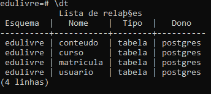
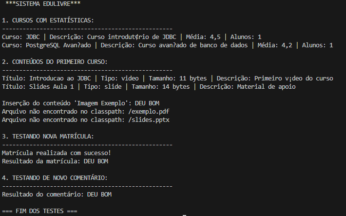

# EduLivre - Plataforma de Cursos Online

## Sumário

1. [Descrição do Projeto](#1-descrição-do-projeto)  
2. [Requisitos e Dependências](#2-requisitos-e-dependências)  
3. [Como Funciona o Projeto](#3-como-funciona-o-projeto)  
4. [Configuração do Banco de Dados](#4-configuração-do-banco-de-dados)  
5. [Estrutura do Projeto](#5-estrutura-do-projeto)  
6. [Compilação e Execução](#6-compilação-e-execução)  
7. [Uso da Imagem de Teste](#7-uso-da-imagem-de-teste)  
8. [Funcionamento da Aplicação](#8-funcionamento-da-aplicação)  
9. [Resultados Esperados](#9-resultados-esperados)  
10. [Consulta do Conteúdo com Imagem](#10-consulta-do-conteúdo-com-imagem)  
11. [Considerações Técnicas](#11-considerações-técnicas)  
12. [Possíveis Problemas e Soluções](#12-possíveis-problemas-e-soluções)  
13. [Referências](#13-referências)  
14. [Contato](#14-contato)  

---

## 1. Descrição do Projeto

O **EduLivre** é um sistema de gerenciamento de cursos online, com funcionalidades como:

- Cadastro de usuários  
- Matrícula em cursos  
- Upload e exibição de conteúdos multimídia (texto, imagem)  
- Armazenamento de avaliações e comentários em JSONB  

A aplicação foi desenvolvida em Java com JDBC, utilizando o banco de dados PostgreSQL.  
Todas as operações são realizadas por meio de DAO (Data Access Objects), com conexão segura e uso de transações.

---

## 2. Requisitos e Dependências

- Java JDK 11 ou superior  
- PostgreSQL 13 ou superior  
- Maven (para build e gerenciamento de dependências)  
- Driver JDBC PostgreSQL (configurado via `pom.xml`)  
- IDE recomendada: VSCode, IntelliJ, Eclipse ou similar  

---

## 3. Como Funciona o Projeto

O sistema é estruturado em camadas:

1. **Camada DAO (Data Access Object):** realiza todas as interações com o banco via JDBC.  
2. **Modelos (classes em `/model`):** representam entidades como Curso, Conteúdo, Matrícula etc.  
3. **Classe principal (`Main.java`):** executa testes e simulações das operações.  
4. **Recursos (`/resources`):** contém arquivos como imagens de teste usadas no projeto  
   - Exemplo: `resources/imagem_teste.jpg`  

Funcionalidades implementadas:

- Listar cursos  
- Buscar conteúdos por curso  
- Inserir matrícula (com validação)  
- Adicionar comentário (JSONB)  
- Inserir conteúdo com imagem (BYTEA)  

---

## 4. Configuração do Banco de Dados

### Criar o usuário e banco no `psql`:


## 2. Executar o script SQL:

bash
psql -U edulivre_user -d edulivre_db -f edulivre_script.sql

## 5. Estrutura do Projeto:

```
/edulivre
├─ src/
│  ├─ main/
│  │  ├─ java/com/edulivre/
│  │  │  ├─ Main.java
│  │  │  ├─ dao/
│  │  │  └─ model/
│  │  └─ resources/
│  └─ target/...
├─ edulivre_script.sql
├─ pom.xml
```


## 6. Compilação e Execução:

   1. Compilar com Maven:
bash
    mvn clean install

2. Executar a aplicação:
   bash
   mvn exec:java -Dexec.mainClass="com.edulivre.Main"

## 7.Uso da Imagem de Teste:

A imagem de teste está na pasta resources:
resources/imagem_teste.png

Ela pode ser usada para inserção em campos binários (BYTEA) do banco, como exemplo de conteúdo multimídia.

Exemplo de comando SQL para inserir a imagem no banco (via PostgreSQL, o arquivo precisa estar acessível pelo servidor):

sql
 INSERT INTO conteudo (curso_id, titulo, descricao, tipo, arquivo)
VALUES (
  'uuid-do-curso',
  'Imagem Teste',
  'Imagem armazenada para teste',
  'imagem',
  pg_read_binary_file('.../recourses/imagem_teste.jpg')
);

--Para fins de teste e simulação no banco de dados PostgreSQL, os registros da tabela conteudo utilizam a função decode(...) para inserir conteúdo binário no campo arquivo, que é do tipo BYTEA. Porém também é possível inserir arquivos reais — como PDFs, imagens, vídeos, áudio, quiz e slide.


-- Caso o usuário tente adicionar o mesmo conteúdo no mesmo local o conteúdo não será inserido. (para evitar duplicacão.)


## 8.Funcionamento da Aplicação:

O sistema implementa as seguintes funcionalidades básicas:

--Listar cursos disponíveis

--Buscar conteúdos relacionados a um curso específico

--Inserir matrícula para um usuário com validação de pré-requisitos

--Adicionar comentários e avaliações, armazenados no campo JSONB
exemplo:


--Inserir conteúdos com arquivos binários (imagens...) usando campo BYTEA

## 9.Resultados Esperados:

Estrutura do banco após criação das tabelas:




## 10.Saída da aplicação rodando (console):




## 11.Consulta do conteúdo com imagem no banco
SELECT id, titulo, tipo FROM conteudo WHERE tipo = 'imagem';


## 12. Considerações Técnicas
JSONB foi utilizado para permitir avaliações com estrutura flexível (nota, comentário, data).

BYTEA permite o armazenamento de arquivos binários, como imagens.

JDBC é utilizado com tratamento de exceções e transações seguras.

Maven cuida de todas as dependências e do build automático.

## 13.Possíveis Problemas e Soluções:

| Problema                      | Solução Recomendada                                                    |
| ----------------------------- | ---------------------------------------------------------------------- |
| Erro de conexão com o banco   | Verificar se o PostgreSQL está rodando e as credenciais estão corretas |
| Arquivo binário não carregado | Verificar caminho absoluto e permissões do arquivo                     |
| Maven não encontrado          | Instalar Maven e configurar variável de ambiente PATH corretamente     |


## 8. Referências
PostgreSQL JDBC Driver

Documentação PostgreSQL

Baeldung - JDBC Java

PostgreSQL JSONB

## 9. Contato
Dúvidas ou sugestões: kethelemsocoowski@gmail.com
